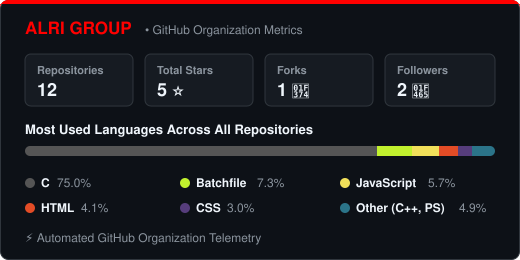

  

  # ALRI GROUP
  **"From a vision in 2020 to a multi-disciplinary tech reality."**

   

  

   

  
  
  

---

### 📖 Our Story
ALRI GROUP began as a dream in **2020**. What started as a conceptual idea by its founder has evolved over the years into a developing ecosystem of specialized technological sub-divisions. Born from a passion for understanding how systems work and pushing their limits, **ALRI GROUP** is now transitioning into a professional organization.

---

### 🏢 Corporate Structure & Subsidiaries
ALRI GROUP operates as a **Holding Company** and **Parent Organization** for specialized tech subsidiaries, allowing each branch to focus exclusively on its domain while sharing core values of security, performance, and low-level control.

🌐 **Website:** [alrigroup.com](https://alrigroup.com)  
🏢 **Explore our companies:** [alrigroup.com/#companies](https://alrigroup.com/#companies)

---

### 🎯 What We Build & Deliver
Through our specialized branches, we deliver custom, high-performance tech solutions:

* ⚙️ **Robust Systems & APIs:** Scalable back-end architectures built for reliability.
* 🛡️ **Cyber Security & Audit:** Identifying and patching critical vulnerabilities before production.
* 🌐 **Web & Native Clients:** Front-end interfaces and multi-platform applications.
* 🔌 **System & Hardware Control:** Tailor-made tools bridging software architecture and low-level hardware.
* 🎮 **Game Mechanics & Engines:** Game design, gameplay logic, and custom modding frameworks.
* 🛠️ **Reverse Engineering:** System modifications, security analysis, and mobile root solutions.

---

### 👤 Founder & Heritage
ALRI GROUP was founded and is led by **Alexsander ([@alexsanderalri](https://github.com/alexsanderalri))**, also known as **Alex AR**.

> 💡 **The Name:** "ALRI" is an acronym derived from the founder's surnames (**Al**meida + **Ri**beiro), forming the brand **ALRI** and its shorthand **AR**.

With a background in security research, low-level systems, reverse engineering, and full-stack engineering, the founder's vision remains the driving force behind every project under the ALRI seal.

---

### 🚀 Future Roadmap
We are actively building the foundations for our sub-divisions to operate as fully specialized units, ensuring that whether we are patching a critical exploit, engineering back-end systems, or building custom mods and software, the **ALRI GROUP** seal stands for quality and security.

---

### 📊 GitHub Organization Metrics

  

 

  
   
  Tracking views for the ALRI Group organization

---

### 📫 Connect & Community

 

  <i>"Building the future, one line of code at a time."</i>

